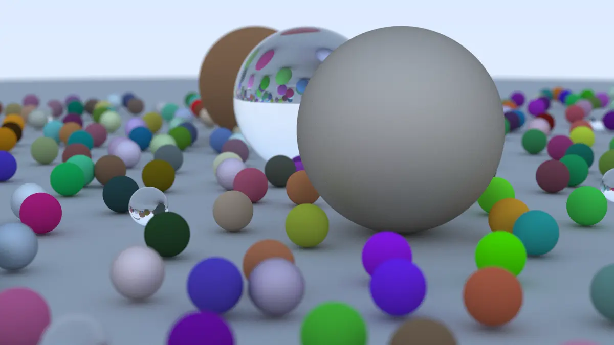

# GoRTX

A ray tracer written in Go

## Features

- Rays!
- Spheres are the only supported primitives. (Can be expanded further)
- Anti-Aliasing
- Materials:
    - Lambertian (matte)
    - Metal
    - Glass or any transparent materials that reflect and refract light
- Camera:
    - A camera that can be positioned anywhere
    - We can control:
        - viewport
        - aspect ratio
        - fov
        - output resolution
        - defocus blur (depth of field)

## Credit

- [_Ray Tracing in One Weekend_](https://raytracing.github.io/books/RayTracingInOneWeekend.html)
- Reference Repo: [rtx zig](https://github.com/gamedevCloudy/rtx-zig)
